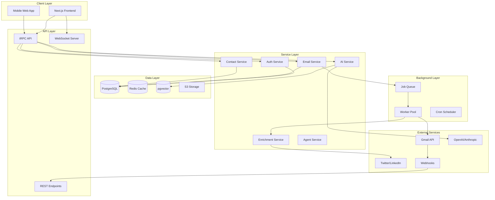

# System Architecture - Component Breakdown

## Architecture Overview



## Core Components

### 1. Authentication Service
**Purpose**: Handle user authentication and authorization
**Key Features**:
- OAuth 2.0 flow for Gmail/Google
- Session management with Better Auth
- JWT token generation and validation
- Permission system for future team features

**Interfaces**:
```typescript
interface AuthService {
  signIn(provider: 'google'): Promise<User>
  signOut(): Promise<void>
  getSession(): Promise<Session | null>
  refreshToken(): Promise<Token>
  hasPermission(resource: string, action: string): boolean
}
```

### 2. Email Service
**Purpose**: Manage email synchronization and operations
**Key Features**:
- Initial and incremental sync strategies
- Real-time updates via webhooks
- Email parsing and thread management
- Attachment handling

**Interfaces**:
```typescript
interface EmailService {
  syncAccount(accountId: string): Promise<SyncResult>
  fetchEmails(query: EmailQuery): Promise<Email[]>
  parseEmail(raw: string): Promise<ParsedEmail>
  extractContacts(email: Email): Promise<Contact[]>
  sendEmail(draft: EmailDraft): Promise<Email>
}
```

### 3. Contact Service
**Purpose**: Intelligent contact management
**Key Features**:
- Contact extraction from multiple sources
- Deduplication and merging logic
- Relationship strength calculation
- Contact statistics and analytics

**Interfaces**:
```typescript
interface ContactService {
  createContact(data: ContactData): Promise<Contact>
  mergeContacts(ids: string[]): Promise<Contact>
  calculateRelationshipStrength(contactId: string): Promise<number>
  getInteractionHistory(contactId: string): Promise<Interaction[]>
  searchContacts(query: string): Promise<Contact[]>
}
```

### 4. AI Service
**Purpose**: Central AI operations and orchestration
**Key Features**:
- LLM provider abstraction
- Context building and RAG
- Function calling interface
- Response caching

**Interfaces**:
```typescript
interface AIService {
  query(prompt: string, context: Context): Promise<AIResponse>
  generateEmail(context: EmailContext): Promise<string>
  extractEntities(text: string): Promise<Entities>
  executeFunction(name: string, args: any): Promise<any>
  buildContext(userId: string, scope: string[]): Promise<Context>
}
```

### 5. Enrichment Service
**Purpose**: Augment contact data from external sources
**Key Features**:
- Multi-source enrichment pipeline
- Rate limiting and quota management
- Data quality scoring
- Incremental updates

**Interfaces**:
```typescript
interface EnrichmentService {
  enrichContact(contact: Contact): Promise<EnrichmentResult>
  findSocialProfiles(email: string): Promise<SocialProfiles>
  getCompanyInfo(domain: string): Promise<Company>
  scheduleEnrichment(contactId: string, priority: Priority): void
}
```

### 6. Agent Service
**Purpose**: Manage AI agents and skills
**Key Features**:
- Agent lifecycle management
- Skill library and execution
- Memory persistence
- Multi-agent coordination

**Interfaces**:
```typescript
interface AgentService {
  createAgent(config: AgentConfig): Promise<Agent>
  executeSkill(agentId: string, skill: string, params: any): Promise<SkillResult>
  getAgentMemory(agentId: string): Promise<Memory>
  coordinateAgents(task: Task): Promise<TaskResult>
}
```

### 7. Background Job System
**Purpose**: Asynchronous task processing
**Key Features**:
- Priority queue with pg-boss
- Job retry with exponential backoff
- Job monitoring and metrics
- Parallel processing

**Job Types**:
```typescript
type JobType = 
  | 'email-sync'
  | 'contact-extraction'
  | 'enrichment'
  | 'ai-analysis'
  | 'report-generation'
  | 'webhook-processing'
```

### 8. Real-time Communication
**Purpose**: Live updates and notifications
**Key Features**:
- WebSocket connections for live updates
- Server-sent events fallback
- Presence system for collaboration
- Push notifications

**Events**:
```typescript
type RealtimeEvent = 
  | { type: 'email.received', data: Email }
  | { type: 'contact.updated', data: Contact }
  | { type: 'agent.completed', data: AgentResult }
  | { type: 'sync.progress', data: SyncProgress }
```

## Data Flow Patterns

### 1. Email Sync Flow
```
User Login → OAuth → Queue Sync Job → Fetch Emails → 
Parse → Extract Contacts → Store → Notify UI
```

### 2. AI Query Flow
```
User Query → Build Context → LLM Call → 
Parse Response → Execute Tools → Return Result
```

### 3. Enrichment Flow
```
New Contact → Queue Enrichment → Check Sources → 
Aggregate Data → Score Quality → Update Contact
```

## Security Architecture

### 1. Data Encryption
- At rest: AES-256 for sensitive fields
- In transit: TLS 1.3
- Tokens: Encrypted with user-specific keys

### 2. Access Control
- Row-level security in PostgreSQL
- API rate limiting per user
- OAuth scope restrictions

### 3. Privacy Features
- Data anonymization for AI prompts
- Local-first architecture option
- GDPR compliance tools

## Scalability Design

### 1. Database
- Partitioning by user_id and date
- Read replicas for analytics
- Connection pooling

### 2. Caching Strategy
- Redis for session data
- PostgreSQL query caching
- CDN for static assets

### 3. Job Processing
- Horizontal scaling of workers
- Queue sharding by user
- Priority lanes for real-time ops

## Monitoring & Observability

### 1. Metrics
- API latency (p50, p95, p99)
- Job processing times
- AI token usage
- Error rates by service

### 2. Logging
- Structured logging with context
- Distributed tracing
- Security audit logs

### 3. Alerts
- Failed sync operations
- AI service degradation
- High error rates
- Resource exhaustion