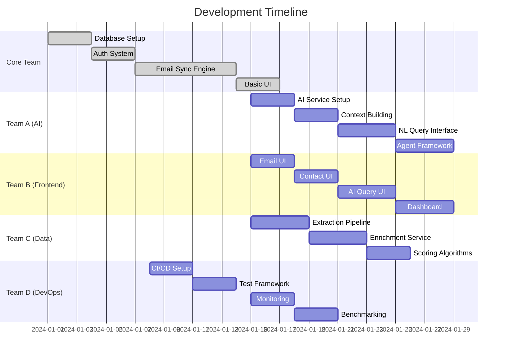

# Parallelization Strategy & Team Organization

## Overview

This document outlines how to maximize development velocity by organizing multiple teams to work in parallel, minimizing dependencies and bottlenecks.

## Team Structure

### Core Team (Weeks 1-3)
**Size**: 2 Senior Engineers  
**Focus**: Foundation that everything depends on
- Database schema and migrations
- Authentication system
- Core API structure
- Background job system
- Email sync engine
- Basic UI shell

### Parallel Teams (Weeks 4-8)

#### Team A: AI Infrastructure (2 Engineers)
**Dependencies**: Core infrastructure only  
**Focus**: 
- AI service abstraction
- Context building system
- Natural language query interface
- Tool execution framework
- Agent framework foundation
- Skill library system

**Can start**: Week 4 (immediately after core)

#### Team B: Frontend & UX (2 Engineers)
**Dependencies**: Core API, basic data models  
**Focus**:
- Email list UI with infinite scroll
- Contact management interface
- AI query interface components
- Real-time updates with WebSockets
- Analytics dashboard
- Agent conversation UI

**Can start**: Week 4 (parallel with Team A)

#### Team C: Data Pipeline & Enrichment (1 Engineer)
**Dependencies**: Core data models, job system  
**Focus**:
- Contact extraction optimization
- Multi-source enrichment
- Email categorization pipeline
- Relationship scoring algorithms
- Data quality monitoring
- Performance optimization

**Can start**: Week 4 (parallel with Teams A & B)

#### Team D: Testing & DevOps (1 Engineer)
**Dependencies**: All core components  
**Focus**:
- CI/CD pipeline setup
- Test framework and utilities
- Integration test suite
- Performance benchmarking
- Monitoring and alerting
- Documentation automation

**Can start**: Week 2 (earlier start for infrastructure)

## Parallelization Map



## Component Dependencies

### Independent Components (Can be built in parallel)
1. **AI Service Layer**
   - Depends on: Database connection
   - Independent of: UI, specific data

2. **Frontend Components**
   - Depends on: API endpoints
   - Independent of: AI implementation details

3. **Enrichment Pipeline**
   - Depends on: Contact model
   - Independent of: UI, AI services

4. **Background Jobs**
   - Depends on: Job queue setup
   - Independent of: Specific job implementations

### Shared Interfaces

To enable parallel development, define interfaces early:

```typescript
// Week 1: Define all interfaces
// src/types/interfaces.ts

export interface EmailService {
  syncAccount(accountId: string): Promise<SyncResult>
  getEmails(query: EmailQuery): Promise<Email[]>
}

export interface AIService {
  query(prompt: string, context?: any): Promise<AIResponse>
  generateEmail(context: EmailContext): Promise<string>
}

export interface ContactService {
  search(query: string): Promise<Contact[]>
  enrich(contactId: string): Promise<EnrichmentResult>
}

export interface AgentService {
  create(config: AgentConfig): Promise<Agent>
  execute(agentId: string, input: any): Promise<any>
}
```

## Communication Protocol

### Daily Sync
- **Time**: 10 AM daily
- **Duration**: 15 minutes max
- **Format**: Each team reports blockers and dependencies

### API Contract Reviews
- **Frequency**: Twice weekly
- **Purpose**: Ensure interfaces remain compatible
- **Participants**: Tech leads from each team

### Shared Resources

#### 1. API Documentation (Weeks 1-2)
```typescript
// Auto-generated from tRPC routes
export const apiDocs = generateOpenAPIDocument(appRouter, {
  title: 'AI CRM API',
  version: '1.0.0',
  baseUrl: 'http://localhost:3000',
})
```

#### 2. Mock Data Factory (Week 1)
```typescript
// src/test/factories.ts
export const factories = {
  user: Factory.define<User>(() => ({
    id: faker.datatype.uuid(),
    email: faker.internet.email(),
    name: faker.name.fullName(),
  })),
  
  contact: Factory.define<Contact>(() => ({
    id: faker.datatype.uuid(),
    email: faker.internet.email(),
    name: faker.name.fullName(),
    relationshipStrength: faker.datatype.float({ min: 0, max: 1 }),
  })),
  
  email: Factory.define<Email>(() => ({
    id: faker.datatype.uuid(),
    subject: faker.lorem.sentence(),
    body: faker.lorem.paragraphs(),
    from: faker.internet.email(),
  })),
}
```

#### 3. Shared UI Components (Week 2)
```typescript
// packages/ui/src/index.ts
export * from './components/Button'
export * from './components/Card'
export * from './components/Dialog'
export * from './components/Table'
// ... all shared components
```

## Parallel Development Guidelines

### 1. Feature Flags
Every team implements features behind flags:
```typescript
if (await FeatureFlags.isEnabled('ai-agents', userId)) {
  // New feature code
}
```

### 2. Database Migrations
- Each team creates migrations in separate folders
- Migrations must be conflict-free
- Review required before merging

### 3. API Versioning
- New endpoints use versioned routes
- Breaking changes require version bump
- Deprecation notices for old versions

### 4. Mock Implementations
Teams provide mocks for dependencies:
```typescript
// Team A provides mock while building real implementation
export const mockAIService: AIService = {
  query: async (prompt) => ({
    response: 'Mock response for: ' + prompt,
    confidence: 0.9,
  }),
  generateEmail: async (context) => 
    'This is a mock email based on your context',
}
```

## Conflict Resolution

### Code Conflicts
1. **Component ownership**: Clear ownership boundaries
2. **Merge strategy**: Feature branches, daily rebases
3. **Conflict resolution**: Team lead coordination

### Design Conflicts
1. **Design system**: Agreed upon in Week 1
2. **Component library**: Shared Storybook
3. **Design reviews**: Weekly with all teams

### API Conflicts
1. **Schema changes**: Require approval from affected teams
2. **Breaking changes**: Must be versioned
3. **Documentation**: Auto-generated and always current

## Optimization Opportunities

### 1. Shared Services
- **Authentication**: One service, all teams use
- **Email templates**: Shared template system
- **Error handling**: Centralized error management

### 2. Reusable Components
- **Data tables**: Generic table with sorting/filtering
- **Form builders**: Dynamic form generation
- **Chart library**: Shared analytics components

### 3. Cross-Team Libraries
```typescript
// packages/shared/src/index.ts
export * from './lib/validation'
export * from './lib/formatting'
export * from './lib/api-client'
export * from './lib/testing-utils'
```

## Quality Gates

### Per-Team Quality Standards
Each team maintains:
- Unit test coverage > 80%
- Integration tests for critical paths
- TypeScript strict mode
- No console errors/warnings

### Integration Points
- API contract tests between teams
- End-to-end tests for complete flows
- Performance benchmarks
- Security audits

## Deployment Strategy

### Continuous Deployment
- Each team can deploy independently
- Feature flags control rollout
- Automated rollback on errors

### Preview Environments
- PR-based preview deployments
- Isolated testing environments
- Shared staging environment

## Success Metrics

### Team Performance
- **Velocity**: Story points completed per sprint
- **Quality**: Bug rate per feature
- **Independence**: Blocked time percentage

### System Performance
- **API response time**: < 200ms p95
- **UI responsiveness**: < 100ms interaction
- **Build time**: < 5 minutes
- **Test suite**: < 10 minutes

## Risk Mitigation

### Technical Risks
1. **Integration failures**: Daily integration tests
2. **Performance regression**: Automated benchmarks
3. **Security vulnerabilities**: Weekly security scans

### Process Risks
1. **Communication breakdown**: Daily standups
2. **Scope creep**: Strict sprint planning
3. **Technical debt**: 20% time for refactoring

## Handoff Protocol

### Week 3 → Week 4 Transition
Core team hands off to parallel teams:
1. **Documentation review**: All APIs documented
2. **Knowledge transfer**: 2-day overlap period
3. **Support rotation**: Core team members embedded

### Inter-Team Handoffs
When teams need to hand off work:
1. **Code review**: Receiving team reviews
2. **Documentation**: Update required
3. **Test coverage**: Must meet standards

## Tools & Infrastructure

### Development Tools
- **Monorepo**: Turborepo for all teams
- **TypeScript**: Shared configurations
- **ESLint/Prettier**: Consistent code style
- **Husky**: Pre-commit hooks

### Collaboration Tools
- **Linear**: Project management
- **Slack**: Real-time communication
- **Notion**: Documentation
- **Figma**: Design collaboration

### Monitoring Tools
- **Sentry**: Error tracking
- **DataDog**: Performance monitoring
- **LogRocket**: Session replay
- **PostHog**: Analytics

## Conclusion

By following this parallelization strategy:
- **6 engineers** work efficiently without blocking each other
- **Features ship continuously** from Week 4 onward
- **Quality remains high** through automated testing
- **Integration is smooth** through clear contracts
- **Deployment is safe** through feature flags

The key is strong initial planning, clear interfaces, and excellent communication throughout the project.