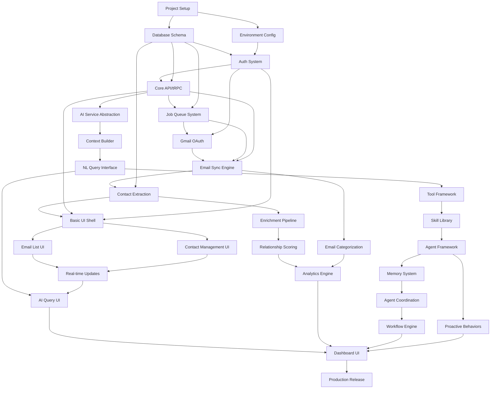

# Implementation DAG (Directed Acyclic Graph)

## Overview

This document presents the complete implementation as a DAG, showing dependencies and parallel work streams. Each node represents a deliverable component with clear inputs and outputs.

## Visual DAG Representation



## Component Dependency Matrix

| Component | Depends On | Enables | Can Start |
|-----------|------------|---------|-----------|
| **Foundation (Core Team)** |
| Project Setup | None | Everything | Day 1 |
| Database Schema | Project Setup | All data ops | Day 2 |
| Environment Config | Project Setup | All services | Day 2 |
| Auth System | Database, Config | Protected routes | Day 3 |
| Core API/tRPC | Database, Auth | All endpoints | Day 5 |
| Job Queue | Database | Background ops | Day 6 |
| Gmail OAuth | Auth | Email access | Day 7 |
| Email Sync Engine | OAuth, Queue, API | Email data | Day 8 |
| Contact Extraction | Email Sync, DB | Contact data | Day 12 |
| Basic UI Shell | API, Auth | All UI | Day 15 |
| **AI Infrastructure (Team A)** |
| AI Service | Core API | AI features | Week 4 |
| Context Builder | AI Service | Smart queries | Week 4 |
| NL Query Interface | Context Builder | User queries | Week 5 |
| Tool Framework | NL Query | AI actions | Week 5 |
| Skill Library | Tool Framework | Agent skills | Week 7 |
| Agent Framework | Skill Library | Agents | Week 7 |
| Memory System | Agent Framework | Persistence | Week 7 |
| Agent Coordination | Memory, Agents | Multi-agent | Week 8 |
| **Frontend (Team B)** |
| Email List UI | Basic UI | Email viewing | Week 4 |
| Contact UI | Basic UI | Contact mgmt | Week 4 |
| Real-time Updates | Email/Contact UI | Live data | Week 5 |
| AI Query UI | NL Query | AI interaction | Week 5 |
| Dashboard UI | All UI, Analytics | Overview | Week 6 |
| **Data Pipeline (Team C)** |
| Enrichment Pipeline | Contacts | Rich profiles | Week 4 |
| Relationship Scoring | Enrichment | Insights | Week 5 |
| Email Categorization | Email Sync | Organization | Week 4 |
| Analytics Engine | Scoring, Categories | Metrics | Week 5 |
| **Advanced (All Teams)** |
| Proactive Behaviors | Agent Framework | Automation | Week 8 |
| Workflow Engine | Agents, Coordination | Complex flows | Week 8 |

## Parallel Work Streams

### Stream 1: Core Infrastructure (Weeks 1-3)
**Owner**: Core Team (2 engineers)
```
1. Project Setup → Environment Config
2. Database Schema → Migrations
3. Auth System → Session Management
4. Core API → Type Safety
5. Job Queue → Worker Pool
6. Email Sync → Data Pipeline
```

### Stream 2: AI Development (Weeks 4-8)
**Owner**: Team A (2 engineers)
```
1. AI Service Layer
   ├── Provider Abstraction
   ├── Response Caching
   └── Error Handling
   
2. Query Processing
   ├── Context Building
   ├── Intent Recognition
   └── Tool Selection
   
3. Agent System
   ├── Skill Development
   ├── Memory Management
   └── Coordination Logic
```

### Stream 3: User Interface (Weeks 4-8)
**Owner**: Team B (2 engineers)
```
1. Component Library
   ├── Design System
   ├── Shared Components
   └── Accessibility
   
2. Feature UIs
   ├── Email Management
   ├── Contact Views
   └── AI Interaction
   
3. Real-time Features
   ├── WebSocket Setup
   ├── Live Updates
   └── Notifications
```

### Stream 4: Data & Analytics (Weeks 4-8)
**Owner**: Team C (1 engineer)
```
1. Data Processing
   ├── Extraction Logic
   ├── Enrichment APIs
   └── Quality Scoring
   
2. Analytics
   ├── Metrics Collection
   ├── Aggregations
   └── Visualizations
```

### Stream 5: Quality & Ops (Weeks 2-8)
**Owner**: Team D (1 engineer)
```
1. Testing Infrastructure
   ├── Test Database
   ├── Mock Services
   └── CI/CD Pipeline
   
2. Monitoring
   ├── Error Tracking
   ├── Performance
   └── Alerts
```

## Critical Path Analysis

The critical path (longest dependency chain) is:
```
Project Setup (1d) →
Database Schema (2d) →
Auth System (2d) →
Core API (3d) →
Job Queue (2d) →
Gmail OAuth (2d) →
Email Sync (4d) →
Contact Extraction (2d) →
Basic UI (3d) →
[Parallel work begins]
```
**Total**: 21 days (3 weeks) before parallel work can begin

## Risk Mitigation

### Technical Risks

| Risk | Impact | Mitigation |
|------|--------|------------|
| Gmail API limits | High | Implement caching, batch operations |
| Database performance | High | Indexes, partitioning, read replicas |
| AI response quality | Medium | Extensive prompt testing, fallbacks |
| Integration failures | Medium | Contract testing, mocks |

### Process Risks

| Risk | Impact | Mitigation |
|------|--------|------------|
| Dependency delays | High | Buffer time, parallel tracks |
| Scope creep | Medium | Strict phase boundaries |
| Team coordination | Medium | Daily standups, clear ownership |
| Quality issues | Low | Automated testing, code reviews |

## Milestone Checkpoints

### Week 1 Checkpoint
- [ ] Database running with schema
- [ ] Auth system functional
- [ ] Basic API responding
- [ ] CI/CD pipeline active

### Week 2 Checkpoint
- [ ] Gmail sync working
- [ ] Contacts extracted
- [ ] Job queue processing
- [ ] Test coverage > 60%

### Week 3 Checkpoint
- [ ] Basic UI complete
- [ ] Email data visible
- [ ] Contact list working
- [ ] Ready for parallel teams

### Week 4 Checkpoint
- [ ] AI queries working
- [ ] Email categorization active
- [ ] Enrichment started
- [ ] UI components library ready

### Week 5 Checkpoint
- [ ] NL interface complete
- [ ] Real-time updates working
- [ ] Analytics calculating
- [ ] Performance benchmarks passing

### Week 6 Checkpoint
- [ ] Dashboard complete
- [ ] All core features integrated
- [ ] Test coverage > 80%
- [ ] Documentation current

### Week 7 Checkpoint
- [ ] Agent system functional
- [ ] Skills library populated
- [ ] Memory persistence working
- [ ] Security audit passed

### Week 8 Checkpoint
- [ ] Proactive behaviors active
- [ ] Workflow engine complete
- [ ] All integration tests passing
- [ ] Production ready

## Optimization Opportunities

### Parallelization Points
1. **After Basic UI**: Frontend team can build all views
2. **After Email Sync**: Data team can build analytics
3. **After Core API**: AI team can develop independently
4. **After Job Queue**: Background processes can be added

### Acceleration Options
1. **Pre-built components**: Use existing UI library
2. **Service stubs**: Teams work against mocks
3. **Feature flags**: Deploy incomplete features safely
4. **Incremental delivery**: Ship working parts early

## Success Criteria

### Technical Success
- All components integrated and tested
- Performance meets benchmarks
- Security audit passed
- 99.9% uptime achieved

### Product Success
- All Phase 1-3 features delivered
- User flows smooth and intuitive
- AI responses helpful and accurate
- System scales to 1000+ users

### Process Success
- Delivered on schedule
- Teams worked independently
- Quality maintained throughout
- Knowledge documented

## Implementation Checklist

### Pre-Development
- [ ] Team assignments clear
- [ ] Development environment ready
- [ ] Access to all services granted
- [ ] Documentation templates prepared

### During Development
- [ ] Daily standups happening
- [ ] Blockers addressed quickly
- [ ] Integration tests running
- [ ] Progress tracked visually

### Post-Development
- [ ] All tests passing
- [ ] Documentation complete
- [ ] Deployment automated
- [ ] Monitoring active

## Conclusion

This DAG provides a complete roadmap for implementing the AI CRM system. By following these dependencies and parallelization opportunities, the team can:

1. **Minimize idle time** through parallel work streams
2. **Reduce integration risk** through clear interfaces
3. **Maintain quality** through continuous testing
4. **Deliver on schedule** through careful planning

The key to success is strong communication, clear ownership, and disciplined execution of this plan.